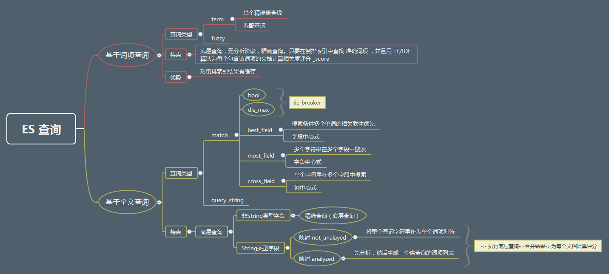

<!-- more -->

* [结构化查询](#1)
    * [精确匹配 term](#1.1)
    * [组合过滤器 bool ](#1.2)
* [全文检索](#2)
    * [match查询](#2.1)
    * [组合过滤器 bool ](#2.2)
* [多字段查询](#3)
    * [best fields](#3.1)
    * [most fields](#3.2)
    * [cross fields](#3.3)
* [邻近匹配](#4)
    * [best fields](#3.1)
    * [most fields](#3.2)
    * [cross fields](#3.3)

<h2 id="1">结构化查询</h2>
精确值查找使用filter, 由于该类搜索有缓存，因此搜索速度相较于全文检索要更快。

__关于缓存__：
ES在运行精确查找的时候会执行多个操作：

1. 查找匹配文档，term查询在倒排索引中查找满足条件的所有文档。
2. 创建bitset(一个包含0和1的数组)，它描述了哪个文档包含该term. 匹配则置为1，[1,0,0,0]说明第一个文档匹配。
3. 迭代bitsets. 一旦为每个查询生成了bitsets, ES会循环迭代bitsets 从而找到满足所有过滤条件的匹配文档集合。
4. 增量使用技术。 ES会为每个索引跟踪保留查询使用的历史状态，如果查询在最近的256次查询中会被用到，那么它就会被缓存到内存中。当bitset被缓存后，缓存会在那些容量低于10000个文档的段中忽略。（因为这些容量小的端会消失，为他们分配缓存是一种浪费。）

一旦缓存bitset, bitset可以复用任何已经使用过的相同过滤器，而无需再次计算整个过滤器。这是因为，属于查询组件的bitset是独立于它所属搜索请求其他部分的，这意味着，一旦被缓存，一个查询可以被用作多个搜索请求。

<h3 id="1.1">精确匹配 term</h3>

term query finds documents that contain the exact term specified in the inverted index(精确匹配，term过滤器)。

例外，term过滤器匹配过程是 _包含_ ，而非等值。如果我们有一个 term（词项）过滤器`{ "term" : { "tags" : "search" } }`  ，它会与以下两个文档同时 匹配：
~~~
{ "tags" : ["search"] }
{ "tags" : ["search", "open_source"] }
~~~

查询条件分为以下两种情况：

- 非string字段
    默认精确搜索
- string字段
    如果要使用精确搜索，需要在mapping - 字段index配置项指定“not_analyzed”

示例：在倒排索引中查询user字段是否精确匹配
~~~
POST _search
{
"query":{
    "term":{
      "user_id":200002
    }
  }
}
~~~

A `boost` parameter can be specified to give this term query a higher relevance score than another query, for instance
~~~~
GET _search
{
  "query": {
    "bool": {
      "should": [
        {
          "term": {
            "status": {
              "value": "urgent",
              "boost": 2.0
            }
          }
        },
        {
          "term": {
            "status": "normal"
          }
        }
      ]
    }
  }
}
~~~~

通常当查找一个精确值的时候，我们不希望对查询进行评分计算。只希望对文档进行包括或排除的计算，所以我们会使用 constant_score 查询以非评分模式来执行 term 查询并以一作为统一评分。

term 更高效地写法：
~~~~
{
 "query" : {
        "constant_score" : {
            "filter" : {
                "term" : {
                    "category_name" : "服装"
                }
            }
        }
    }
}
~~~~
<h3 id="1.2">组合过滤器bool</h3>
类似sql 的and or查询，要使用bool过滤器（复合过滤器）。
格式：
~~~~
{
   "bool" : {
      "must" :     [],
      "should" :   [],
      "must_not" : [],
   }
}
~~~~
~~~~
{
   "query" : {
      "filtered" : {
         "filter" : {
            "bool" : {
              "should" : [
                 { "term" : {"color_name" : "棕色"}},
                 { "term" : {"color_name" : "白色"}}
              ],
              "must_not" : {
                 "term" : {"price" : 30}
              }
         }
      }
    }
  }
}
~~~~

等同于sql

~~~
where( color_name = "棕色" or color_name = "白色"  ) and (price != 30)
~~~

####  嵌套布尔过滤器
~~~~
SELECT document
FROM   products
WHERE  productID      = "KDKE-B-9947-#kL5"
  OR (     productID = "JODL-X-1937-#pV7"
       AND price     = 30 )
~~~~

我们将其转换成一组嵌套的 bool 过滤器：
~~~
GET /my_store/products/_search
{
   "query" : {
      "filtered" : {
         "filter" : {
            "bool" : {
              "should" : [
                { "term" : {"productID" : "KDKE-B-9947-#kL5"}},
                { "bool" : {
                  "must" : [
                    { "term" : {"productID" : "JODL-X-1937-#pV7"}},
                    { "term" : {"price" : 30}}
                  ]
                }}
              ]
           }
         }
      }
   }
}
~~~
####  查找多个精确值
等价于`where price = 20 or price =30`

~~~~
{
    "terms":{
        "price":[20,30]
    }
}
~~~~

~~~
GET /my_store/products/_search
{
    "query" : {
        "constant_score" : {
            "filter" : {
                "terms" : {
                    "price" : [20, 30]
                }
            }
        }
    }
}
~~~
####  范围
range 查询：查询处于某个范围的文档。可供组合的选项如下：

- gt: > 大于（greater than）
- lt: < 小于（less than）
- gte: >= 大于或等于（greater than or equal to）
- lte: <= 小于或等于（less than or equal to）
~~~
GET /my_store/products/_search
{
    "query" : {
        "constant_score" : {
            "filter" : {
                "range" : {
                    "price" : {
                        "gte" : 20,
                        "lt"  : 40
                    }
                }
            }
        }
    }
}
~~~

Note: 数字和日期字段的索引方式使高效地范围计算成为可能。 但字符串却并非如此，要想对其使用范围过滤，Elasticsearch 实际上是在为范围内的每个词项都执行 term 过滤器，这会比日期或数字的范围过滤慢许多。

字符串范围在过滤 低基数（low cardinality） 字段（即只有少量唯一词项）时可以正常工作，但是唯一词项越多，字符串范围的计算会越慢。

<h2 id="2">全文检索</h2>
全文检索两个最重要的方面是：

- 相关性 Relevance
    它是评价查询与其结果间的相关程度，并根据这种相关程度对结果进行排名的一种能力，这种相关程度的计算方法可以是TF/IDF，地理位置临近，模糊相似，或者其他算法。
- 分析 Analysis
    它是将文本块拆分为有区别的、规范化的token的一个过程。目的是为了 __创建倒排索引__ 以及 __查询倒排索引__

<h3 id="2.1">match查询</h3>
匹配查询match是个 __核心__ 查询。无论需要查询什么字段，match查询都应该会是首选的查询方式。 它是一个高级全文查询，这表示它既能处理全文字段，又能处理精确字段.这就是说，  match 查询主要的应用场景就是进行全文搜索. 

match的单词匹配
~~~
GET /my_index/my_type/_search
{
    "query": {
        "match": {
            "title": "QUICK!"
        }
    }
}
~~~

Elasticsearch 执行单词匹配这个 match 查询的步骤是：

1. 检查字段类型 。

    标题 title 字段是一个 string 类型（ analyzed ）已分析的全文字段，这意味着查询字符串本身也应该被分析。

2. 分析查询字符串 。

    将查询的字符串 QUICK! 传入标准分析器中，输出的结果是单个项 quick 。因为只有一个单词项，所以 match 查询执行的是单个底层 term 查询。

3. 查找匹配文档 。

    用 term 查询在倒排索引中查找 quick 然后获取一组包含该项的文档，本例的结果是文档：1、2 和 3 。

4. 为每个文档评分 。

    用 term 查询计算每个文档相关度评分 _score_ ，这是种将 词频（term frequency，即词 quick 在相关文档的 title 字段中出现的频率）和反向文档频率（inverse document frequency，即词 quick 在所有文档的 title 字段中出现的频率），以及字段的长度（即字段越短相关度越高）相结合的计算方式。参见 相关性的介绍 。

match的多次匹配
~~~
GET /my_index/my_type/_search
{
    "query": {
        "match": {
            "title": "BROWN DOG!"
        }
    }
}
~~~
因为 match 查询必须查找两个词（ ["brown","dog"] ），它在内部实际上先执行两次 term 查询，然后将两次查询的结果合并作为最终结果输出。为了做到这点，它将两个 term 查询包入一个 bool 查询中

以上示例告诉我们一个重要信息：即任何文档只要 title 字段里包含 指定词项中的至少一个词 就能匹配，被匹配的词项越多，文档就越相关

如果想提高精度，让所有词都能匹配
~~~~
{
    "query": {
        "match": {
            "category_name": {      
                "query":    "服装，食品",
                "operator": "and"
            }
        }
    }
}
~~~~
还可以控制精度，如果有如果用户给定 5 个查询词项，想查找只包含其中 4 个的文档，该如何处理？

match 查询支持 minimum_should_match 最小匹配参数， 这让我们可以指定必须匹配的词项数用来表示一个文档是否相关。我们可以将其设置为某个具体数字，更常用的做法是将其设置为一个百分数，因为我们无法控制用户搜索时输入的单词数量：
~~~~
GET /my_index/my_type/_search
{
  "query": {
    "match": {
      "title": {
        "query":                "quick brown dog",
        "minimum_should_match": "75%"
      }
    }
  }
}
~~~~

<h3 id="2.2">结构化查询</h3>
类似于过滤器的写法，全文检索的bool查询也接受`must`, `must_not`, `should`. 所有 must 语句必须匹配，所有 must_not 语句都必须不匹配，但有多少 should 语句应该匹配呢？ 默认情况下，没有 should 语句是必须匹配的（should条件项可以不满足，但是一旦满足，评分会更高。），只有一个例外：那就是当没有 must 语句的时候，至少有一个 should 语句必须匹配。

全文检索的bool query会为每个文档计算相关度评分`_score`,

`_queryscore = (all_matched_must_score +　all_matched_should_score) / (must + should 语句总数)`

同样，可以通过 minimum_should_match 参数控制需要匹配的 should 语句的数量， 它既可以是一个绝对的数字，又可以是个百分比

### 查询语句权重
bool查询不仅限于组合查询单个词`match`查询，它可以组合任意其他的查询。通过汇总多个独立查询的分数，从而达到为每个文档微调相关度评分`_score`。

调整评分方法：
- `should` 查询语句匹配得越多表示文档的相关度越高。

- 可以通过指定 `boost`来控制任何查询语句的相对的权重， `boost` 的默认值为 1 ，大于 1 会提升一个语句的相对权重

~~~~
GET /_search
{
    "query": {
        "bool": {
            "must": {
                "match": {  
                    "content": {
                        "query":    "full text search",
                        "operator": "and"
                    }
                }
            },
            "should": [
                { "match": {
                    "content": {
                        "query": "Elasticsearch",
                        "boost": 3
                    }
                }},
                { "match": {
                    "content": {
                        "query": "Lucene",
                        "boost": 2
                    }
                }}
            ]
        }
    }
}

~~~~

<h2 id="2">多字段查询</h2>

最简单的一种，将不同查询字符串映射到不同字段，进而写多个match查询。
~~~
GET /_search
{
  "query": {
    "bool": {
      "should": [
        { "match": { "title":  "War and Peace" }},
        { "match": { "author": "Leo Tolstoy"   }}
      ]
    }
  }
}
~~~
bool查询 ： 查询条件匹配的越多越好。 因此匹配多个查询条件的文档评分要高于只匹配一个查询条件的文档。

### single query string

- best fields
    searching for words that represent a concept, such as "brown fox", the words mean more together than they do individually.

- most fields

    - 最常见的bool 查询，查询条件匹配地越多越好。
    - 通过将一个词索引到多个fields, 微调查询相关性。

- cross fields

    - 适合实体信息分散在多个field（子field）中的场景，例如Person field由first_name 和 last_name两个子field组成。我们希望在 任何 这些列出的字段中找到尽可能多的词，这有如在一个大字段中进行搜索，这个大字段包括了所有列出的字段。

每一种搜索都有自己的一套策略。

<h3 id="3.1">最佳字段查询</h3>

`dis_max`如果查询是“albino elephant”，`dis_max`确保匹配一个字段的“albino”和匹配另一个字段的“elephant”得到比匹配两个字段的“albino”更高的分数。

~~~
{
    "query": {
        "dis_max": {
            "queries": [
                { "match": { "title": "Brown fox" }},
                { "match": { "body":  "Brown fox" }}
            ]
        }
    }
}
~~~

还可以通过`tie_breaker`来调优，当两个文档中都不具有同时包含 两个词 的 相同字段时候，剩下的结果还是需要bool查询来排序的。

tie_breaker 参数提供了一种`dis_max`和`bool`之间的折中选择，它的评分方式如下：

1. 获得最佳匹配语句的评分 `_score` 。

2. 将其他匹配语句的评分结果与 `tie_breaker` 相乘。

3. 对以上评分求和并规范化。

`multi_match`
~~~
{
    "multi_match": {
        "query":                "Quick brown fox",
        "type":                 "best_fields",
        "fields":               [ "title", "body" ],
        "tie_breaker":          0.3,
        "minimum_should_match": "30%"
    }
}
~~~
<h3 id="3.2">多数字段 most_fields</h3>

为了对相关度进行微调，常用的一个技术就是**将相同的数据索引到不同的字段，它们各自具有独立的分析链。**

主字段包括`词源`，`同义词`以及`变音词`用来匹配尽可能多的文档。

相同的文本被索引到其他字段，以提供更精确的匹配。-- 其他字段作为匹配每个文档时提高相关度评分的信号，匹配字段越多则越好。

示例：如果我们有两个文档，其中一个包含词 jumped ，另一个包含词 jumping ，用户很可能期望后者能排的更高，因为它正好与输入的搜索条件（jumping rabbits）一致。

title字段多个索引
~~~
PUT /my_index
{
    "settings": { "number_of_shards": 1 },
    "mappings": {
        "my_type": {
            "properties": {
                "title": {
                    "type":     "string",
                    "analyzer": "english",
                    "fields": {
                        "std":   {
                            "type":     "string",
                            "analyzer": "standard"
                        }
                    }
                }
            }
        }
    }
}
~~~
most_field 微调精度 示例
~~~
GET /my_index/_search
{
   "query": {
        "multi_match": {
            "query":  "jumping rabbits",
            "type":   "most_fields",
            "fields": [ "title", "title.std" ]
        }
    }
}
~~~

用广度匹配字段 title 包括尽可能多的文档——以提升召回率——同时又使用字段 title.std 作为 信号 将相关度更高的文档置于结果顶部。

<h3 id="3.3">cross-fields entity search</h3>
person 字段可能是这么索引的
~~~
{
    "firstname":  "Peter",
    "lastname":   "Smith"
}
~~~
与most-fields（多字段-多个查询字符串）相比，cross-fields 查询情景为单个字符串在多个字段中进行搜索。

用户可能想搜索 “Peter Smith” 这个人，这些词出现在不同的字段中，如果使用dis_max 或者best_fields查询是错误的方式。

我们想要的结果是：`词 peter 和 smith 都必须出现，但是可以出现在任意字段中 只要词都出现就可以。`

而most_fields是只要出现一个就行。

要用 title 和 description 字段搜索图书，可能希望为 title 分配更多的权重。使用“Peter smith”跨字段查询示例：
~~~
GET /books/_search
{
    "query": {
        "multi_match": {
            "query":       "peter smith",
            "type":        "cross_fields",
            "fields":      [ "title^2", "description" ]
        }
    }
}
~~~

>比较dis_max 和cross_field

`dis_max`是在多字段中查找，但是查询条件需要同时出现在一个字段;字段中心式
`cross_field`在多字段中查找，但是查询条件不需要同时出现在一个字段;词中心式

[参考的教程](http://elasticsearch.cn/book/elasticsearch_definitive_guide_2.x/_ranges.html)