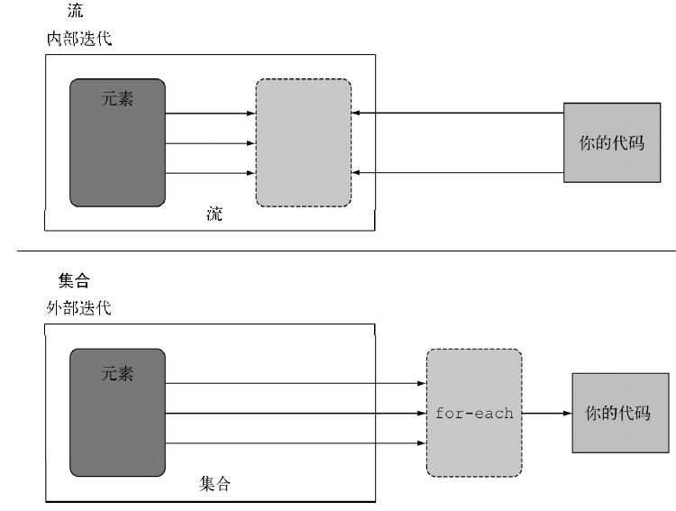

> 编写简洁而灵活的代码，能够轻松地适应不断变化的需求


导读： 通过本文，你可以了解为什么Jdk1.8引入lambda表达式，一些设计思想；还有你怎么使用lambda表达式让你的代码更加优雅一些。另外，你还可以接触一点流(Stream)和并行开发的知识.

<!-- more -->

jdk1.8于2014年3月18日发布，是目前(2017年8月)jdk最新以及最重要的版本。相对于之前的jdk版本，1.8对于语言，编译器，库，工具和JVM等多个方面的进行了提升。本文主要聊聊Jdk1.8新提出的lambda表达式。


## 为什么要引入lambda表达式

在了解lambda表达式的用法之前，不如先弄清**为什么要引入lambda表达式。**关于此问题，现在有几类主流解释：

####  1. 将函数式编程优点添加到面向对象的Java中
众所周知，Java是面向对象语言（遥记得在上大学时候，Java女老师那句经典的“万事万物皆对象”）。的确，Java语言发展这么多年来一直是“重对象，轻函数”的设计理念。函数对于Java这种依赖于对象存在的语言似乎不那么重要，Java语言设计者们在设计时也不那么考虑函数，因此造成Java语言无法将**函数作为函数的输入参数传递**(只能借助 _匿名内部类_ 这种别扭的方式)。例如线程池处理代码：

示例1：

```java
        ThreadPoolTaskExecutor threadPooltaskExecutor = getTaskExcutor(5,10,30,"sendMsgExecutor-");
        threadPooltaskExecutor.initialize();
        threadPooltaskExecutor.execute(new Runnable() {
            @Override
            public void run() {
                System.out.println("this is gsm!");
            }
        });
```

纵观其他倍受欢迎的开发语言，例如JavaScript这种函数式编程语言就可以轻易实现传递函数的功能。函数式编程语言提供了一个非常强大的功能，就是**闭包**。闭包是一个定义在一个函数内部的函数，它可以获取超越其作用域的外部变量。在本质上讲，闭包就是将函数内部和函数外部连接起来的一个桥梁（是不是很像内部类？）。[Viral Patel](http://viralpatel.net/blogs/Lambda-expressions-Java-tutorial/)认为Java为了弥补缺失函数式编程的不足而引入了lambda表达式，lambda表达式不是闭包，却在功能上无限接近闭包。

例如线程池处理代码就可以用如下的lambda表达式写出，你会发现代码终于不需要写的那么繁琐了：

示例2：

```java

        ThreadPoolTaskExecutor threadPooltaskExecutor = getTaskExcutor(5,10,30,"sendMsgExecutor-");
        threadPooltaskExecutor.initialize();
        threadPooltaskExecutor.execute(() ->
         {
             System.out.println("this is gsm!");
             }
       );

```
#### 2. 行为参数化
《Java 8实战》的作者，Java 8的布道者[Mario Fusco](https://dzone.com/articles/why-we-need-lambda-expressions)认为，相比于Java世界里普遍的传递数值到方法中，传递一个lambda表达式到函数的意义在于程序员们可以传递**一种行为**到方法，从而提高了API的复用性以及面向对象编程的抽象能力。

传递一种行为可以理解为通过API传递代码，我们可以回看示例2, 我们通过给`execute`传递了一段代码，能够让`execute`按照我们想要的方式执行某种行为。

再举个栗子，根据不同规则统计某一类数的和：

示例3：
```Java
public int sumAll(List<Integer> numbers, Predicate<Integer> p) {
    int total = 0;
    for (int number : numbers) {
        if (p.test(number)) {
            total += number;
        }
    }
    return total;
}


sumAll(numbers, n -> true);
sumAll(numbers, n -> n % 2 == 0);
sumAll(numbers, n -> n > 3);
```

示例里，我们不仅仅传递数值`(List<Integer> numbers)`到方法`sumAll`中，还传递判断的行为`Predicate`，借此实现高扩展的统计不同类别的列表的方法。

#### 3. 为了支持更优雅及高效的遍历操作，以及支持一种优于集合的操作-流

集合是Java中使用最多的API，我们每天都要对集合进行各种各样的操作。遍历操作可以分为两种

- 外部遍历
- 内部遍历

外部遍历是用户自己使用Java collection的接口手写遍历：

示例4：获取商品列表中商品的名称，形成一个名称列表

```java
    Goods goods1 = new Goods();
    goods1.setName("P&G");
    Goods goods2 = new Goods();
    goods2.setName("DELL");
    Goods goods3 = new Goods();
    goods3.setName("APPLE");
    Goods goods4 = new Goods();
    goods4.setName("LENOVO");
    List<Goods> skuList = Arrays.asList(goods1,goods2,goods3,goods4); // 初始化一个商品列表

    List<String> goodsNameList = new ArrayList<>();

    Iterator<String> iterator = skulist.iterator();
    while(iterator.hasNext()) {
        Goods goods = iterator.next();
        goodsNameList.add(goods.getName());
    }
```

内部遍历方式则是将遍历责任从客户端转移到了服务端（`Streams库`）。服务端`Streams`使用内部遍历，可以选择自己适合的遍历方式帮用户把遍历做了。

示例5：
```Java
List<String> goodsNameList = skuList.stream()
                                    .map(goods -> goods.getName()) //getName()方法参数化map，提取商品名称
                                    .collect(Collectors.toList());
```

`Streams` 库提供一些预先定义好的操作，用户只需要用声明的方法指定想要使用什么操作(像`map`,`filter`,`collect`...)即可。大多数这类操作都接收Lambda表达式作为参数，让用户定制自己需要传递的行为, 而用户并不需要自己去实现。内部遍历最优雅的点在于，流操作可以优化处理顺序，原来collection遍历多次的操作，通过流只需要遍历一次即可。

`Streams`甚至还可以选择一种适合你硬件的数据表示和并行实现，利用多核CPU并行处理集合。要知道，jdk8主推parallel programming遍历, 从而达到更加高效率的遍历。

引用《java8实战》中的比较内部遍历和外部遍历的图，可以让我们更加清晰的明白二者的差异

<!-- <div align = center> -->

<!--  -->


<!-- </div> -->


## 正菜来了：究竟什么是lambda 表达式
lambda表达式最初来源于学术界开发出来的一套用来描述
计算的λ演算法。lambda表达式由三部分组成：

- 参数列表
- 箭头 ->
- lambda主体（实际操作行为）
    - lambda表达式没有return语句，return已经隐含在lambda主体之中了。

**语法SynTax:**
```
(parameters) -> expression
```
或者
```
(parameters) -> {statements}
```

**栗子Example:**
```Java
1. (int x, int y) -> x + y                          
// ->左边： lambda参数， ->右边：lambda主体.
//  此lambda表达式具有两个int型的输入参数，并返回int型的和。
2. (Goods good) -> good.getName.isEqual("P&G")     //此lambda表达式有Goods good类型的参数，并返回boolean的返回值。
3. () -> 42                                         // 无参，返回int
4. (String s) -> System.out.println(s)              // 输入string, 无返回
5. x -> 2 * x                                       //
6.(Apple a1, Apple a2) -> a1.getWeight().compareTo(a2.getWeight()) //具有两个Apple类型的参数，返回一个int：比较两个Apple的重量
```
### 函数式接口 functional interface
Jdk库中已经定义了大量函数式接口，例如
```java
 public interface Runnable { void run(); }
 public interface Callable<V> { V call() throws Exception; }
 public interface ActionListener { void actionPerformed(ActionEvent e); }
 public interface Comparator<T> { int compare(T o1, T o2); boolean equals(Object obj); }
```

函数式接口是一种特殊的`SAM类型（Single Abstract Method）--只定义一个抽象方法`的接口。`@FunctionalInterface`标注一个接口即表示该接口是一个函数式接口，如果你用@FunctionalInterface定义了一个接口，而它却不是函数式接
口的话，编译器将返回一个提示原因的错误。

Lambda表达式是函数式接口的实例。以函数式接口为参数的方法，可以在调用时使用lambda表达式作为参数。

例如jdk1.8中`java.lang.Runnable`的源码：
```java
@FunctionalInterface
public interface Runnable {
    public abstract void run();
}
```

`TaskPoolTaskExecutor`源码：
```java
    public void execute(Runnable task) {
        ThreadPoolExecutor executor = this.getThreadPoolExecutor();

        try {
            executor.execute(task);
        } catch (RejectedExecutionException var4) {
            throw new TaskRejectedException("Executor [" + executor + "] did not accept task: " + task, var4);
        }
    }
```

我们在调用线程池执行方法`execute`
```java
threadPooltaskExecutor.execute(() ->
         {
            // 你的代码逻辑;
          }
       );
```

### lambda表达式与匿名类
[匿名类](https://gsmtoday.github.io/2017/09/07/inner-class/)可以看做是lambda表达式的前世今生。因此，我们给lambda表达式传递参数的时候，若该形参在内部类中需要被使用，那么该形参必须要为final.

## 参考：

[1] Maurice Naftalin : http://www.lambdafaq.org/are-lambda-expressions-objects/

[2] Viral Patel: http://viralpatel.net/blogs/Lambda-expressions-Java-tutorial/

[3] Mario Fusco: https://dzone.com/articles/why-we-need-lambda-expression

[4] Raoul-Gabriel Urma, Mario Fusco, Alan Mycroft, 人民邮电出版社, 《Java8实战》


